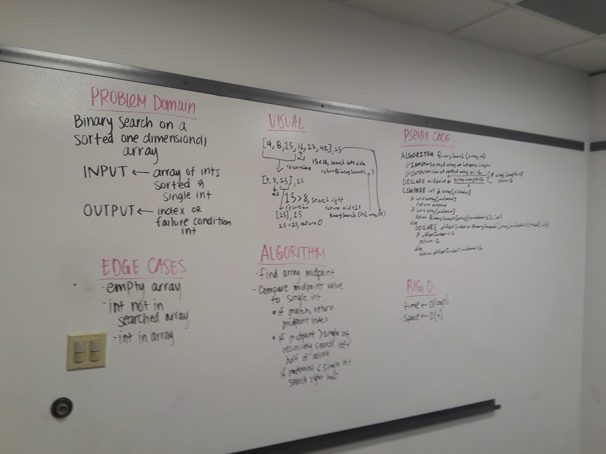

# Binary Search of a sorted Array

## Challenge
Write a method called BinarySearch which takes in a sorted array and the value to be found in the array. 
Without utilizing any of the array search methods available in C#, return either the index where the element
was found, or -1 if the element is not present in the array.

## Approach & Efficiency

1.  This algorithm uses a recursive binary search approach to implement BinarySearch. This is accomplished by
	the middle element of the sorted array to the target value, and either returning that index, searching the
	rest of the array to the left of that index, or searching the rest of the array to the right of the index 
	if the value of the middle element is equal to, greater than, or less than the target value respectively.

2.	Big O Time = O(log(n)) // Big O Space = O(n)
	- Recursive binary search halves the number of elements needed to be searched every time a search is made -
	this means that as the number of elements of the array doubles, only one additional search is needed.
	- This implementation requires a subarray to be created for every new search. Since there are no available 
	methods in the C# language to create a subarray without creating a new array instance, at the worst case we 
	need to instantiate (n/2) + (n/4) + (n/8)... => n new elements to use this algorithm. 

## Solution

Full picture of whiteboard. Apologies for the low quality of image.
