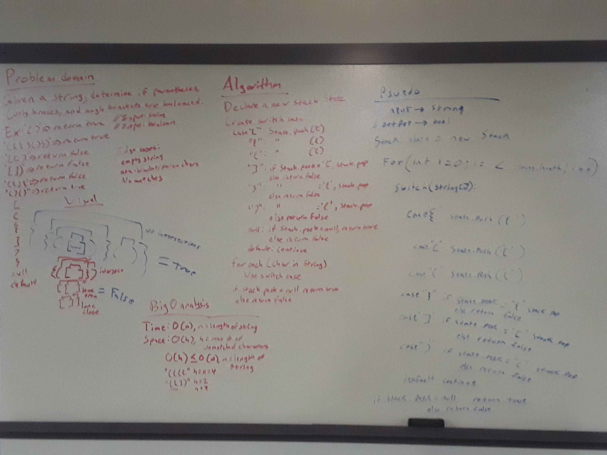

# Multi-bracket Validation
Using a stack to validate whether or not brackets in a string are balanced or not.

## Challenge
On your main file, create a method called public static bool MultiBracketValidation() that takes in a string as its only argument and returns a boolean representing whether or not the brackets in the string are balanced. There are 3 types of brackets: (), [], and {}.

## Approach & Efficiency
1. Approach - This implementation utilizes a single stack to store the context of previously parsed characters from the string. As each character is parsed from the string, the new character will fall into three categories with the following actions taken by the algorithm:
- An opening bracket (either '(', '{', or '['): Add this character to the stack.
- A closing bracket (either ')', '}', or ']'): Check if the top character on the stack is the opening bracket corresponding to the closing bracket. If it is, pop it off the stack; if it is not, return false.
- A non-bracket character: Ignore this and continue, as it has no impact on the state of balance of the stack.

2. Efficiency - Big O Time = O(n) // Big O Space = O(h) (where n is the length of the string being validated, and h is the maximum number of unbalanced opening brackets)
	- This algorithm does require that we parse every character in the string at worst case scenario - thus, it takes at least O(n) time to execute this algorithm. Since we create a new stack in the process of this method, the minimum space required is the maximum size of this stack, h; in the worst case scenario of all characters in the string being opening brackets, h = n.

## Solution

