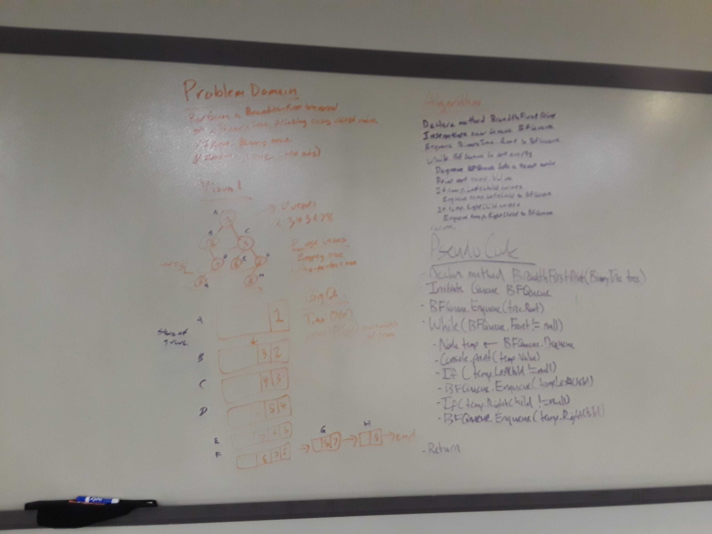

# Breadth First Traversal
Implementing breadth-first traversals through a binary tree, using a queue.

## Challenge
Write a breadth first traversal method which takes a Binary Tree as its unique input. Without utilizing any of the built-in methods available to your language, traverse the input tree using a Breadth-first approach and print every visited node’s value.

## Approach & Efficiency (BFPrint)
1. Approach - This implementation of breadth-first traversals uses the standard approach of a queue to process which nodes to visit. The root node of the tree is enqueued, then the traversal begins a loop - while the queue is not empty, dequeue the front and do the following - print out the value of the node, enqueue the left child of the dequeued node if it exists, and enqueue the right child of the dequeued child if it exists. Due to the first-in, first-out nature of a queue, each level of the tree will be visited left-to-right in order of how deep that level is in the tree, which is equivalent to a breadth-first search; additionally, since all nodes in a tree can be accessed from the root in some manner (there are no isolated branches or islands), we will visit all nodes.

2. Efficiency - Big O Time = O(n) // Big O Space = O(w) (where w is the maximum width of the tree) - In order to evaluate the value of each node, we must visit each node so overall time impact is O(n). We are needing to use a queue to order the list of nodes to visit so, the minimum space needed is going to be the maximum length of the queue - in the worst case where a tree is complete and the last level has the same number of nodes (both the bottom level and second-to-bottom level have w nodes), 3w/2 nodes are required for the queue, which is proportional to w.

## Approach & Efficiency (BFList)
1. Approach - This implementation uses identical conditional logic to the above, but adds to a list as well as printing out a value.

2. Efficiency - Big O Time = O(n) // Big O Space = O(n) - In order to evaluate the value of each node, we must visit each node so the overall time impact is still O(n). However, since this method generates a list of all visited values, the space required extends to O(n), which is strictly worse than the space impact of O(w) of the above method as no tree can have all of its nodes on one level.

## Solution

