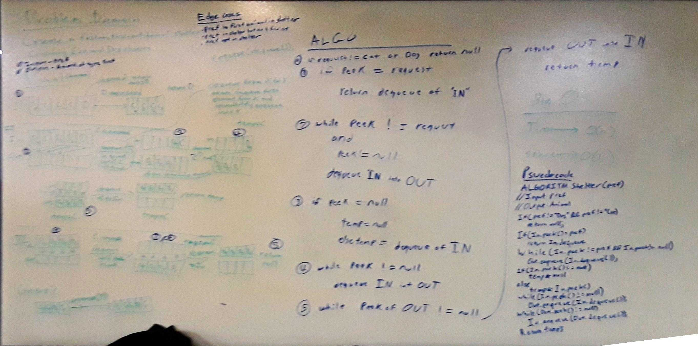

# First-in, first-out Animal shelter
An example of how two queues can interact to let a user filter out a member of a queue without losing order or the first-in, first-out property of queues.

## Challenge
Create a class called AnimalShelter which holds only dogs and cats. The shelter operates using a first-in, first-out approach.
Implement the following methods:
- enqueue(animal): adds animal to the shelter. animal can be either a dog or a cat object. 
- dequeue(pref): returns either a dog or a cat. If pref is not "dog" or "cat" then return null.
- As a stretch goal, if a preference is not given for dequeue, return whichever animal has been waiting the longest.

## Approach & Efficiency
1. Approach - This implementation utilizes two queues, In and Out, to fulfill these requirements. The In queue acts as a standard queue for holding the animals as they are enqueued. The Out queue acts as a helper queue for the In queue during the dequeue process - outside of this method, it should remain empty. The enqueue method is simple - check whether or not the animal being enqueued is a dog or cat, and enqueue it to the In queue if it is. Technically, the check is not actually part of the problem domain, but the problem domain does state to explicitly rejecet non "cat" or "dog" preferences in dequeue, so it seems reasonable to reject those same requests to enqueue as well. The dequeue methods is a bit more complex, breaking into three standard cases:
	- An animal of the requested pref is on top of the In queue: dequeue that animal and return it immediately.
	- An animal of the requested pref is not on top of the In queue, but exists in the queue: Continually dequeue animals from the In queue and enqueue them into the Out queue until the next animal seen is of the requested preference. Dequeue the matching animal and temporarily store it in an Animal object. Dequeue the rest of the animals (if any) from the In queue and enqueue them into the Out queue. Dequeue all animals from the Out queue and enqueue them into the In queue. Return the matching animal stored in the temporary Animal object.
	- An animal of the requested pref is not in the In queue: Continually dequeue animals from the In queue and enqueue them into the Out queue until the In queue is empty. As there is no matching animal, set the temporary Animal object to null. Dequeue all animals from the Out queue and enqueue them into the In queue. Return the null temporary Animal object.

2. Efficiency - Enqueue: Big O Time = O(1) // Big O Space = O(1); Dequeue: Big O Time = O(n) // Big O Space = O(1)
	- Enqueue: This method only requires a single enqueue to the In queue in all cases, so inherits the O(1) time and space impact of the queue's enqueue method.
	- Dequeue: In the worst case scenario (the animal requested is not on the top of the In queue, cases 2 or 3), we require 2n enqueues and dequeues, as we need to move every animal from In to Out and back from Out to In in order to ensure that an animal exists within the queue and to maintain first-in, first-out functionality. Since both enqueue and dequeue only take up O(1) space and time impact, this means that the time impact of this method is no better than O(n). However, since we only create a single new animal as a temporary object to capture the return value, we only require O(1) space. 

## Solution

