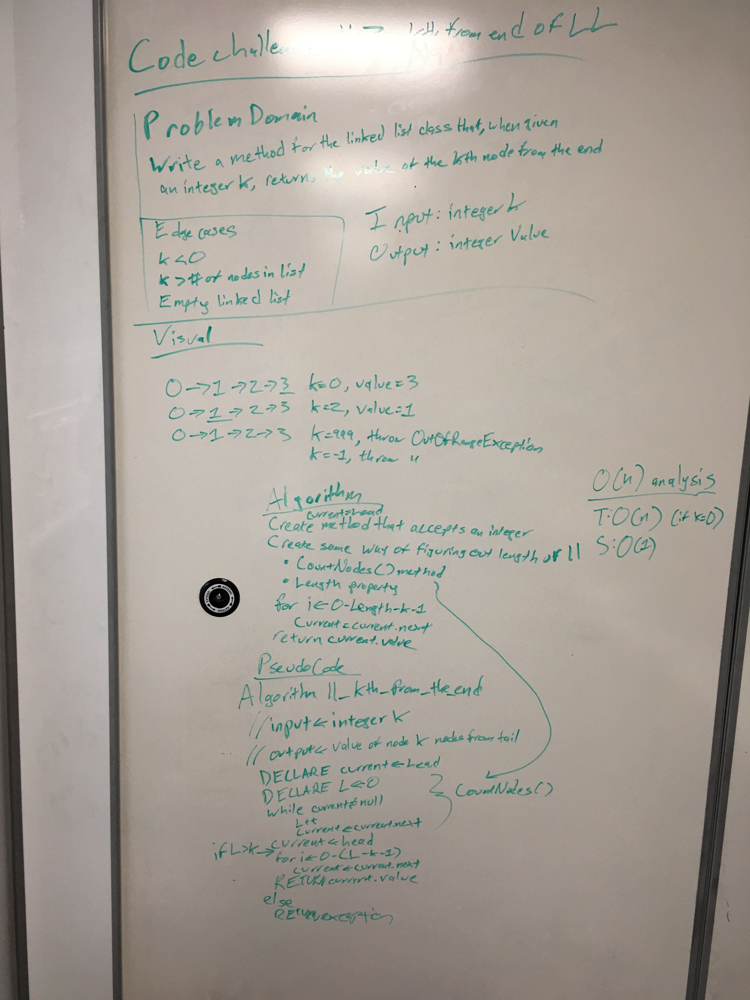

# Return Kth value from the end of a singly-linked list

## Challenge
Write a method for the Linked List class which takes a number, k, as a parameter. Return the node’s value that is k from the end of the linked list. 
You have access to the Node class and all the properties on the Linked List class as well as the methods created in previous challenges.

## Approach & Efficiency

1.  This algorithm uses a previously implemented method to count the number of nodes in the list (call this value L). In order to reach the nth node from the initial first node, we need to make n-1 node-to-node traversals; thus, to reach the nth node from the tail of the linked list, we need to make L-n-1 traversals (the last node would be the Lth node in the list). 

2.	Big O Time = O(n) // Big O Space = O(1)
	- Two traversals are needed for this - a full traversal to get the length of the linked list, and a partial traversal to get to the kth node from the end. Up until the worst case, the first traversal dominates the time needed to implement this solution; since the O time impact of a full traversal is O(n), this algorithm too has a time impact of O(n).
	- This implementation only requires a value to be created in order to keep track of the number of nodes, regardless of the number of nodes - this means that this implementation has a constant space impact of O(1)

## Solution

