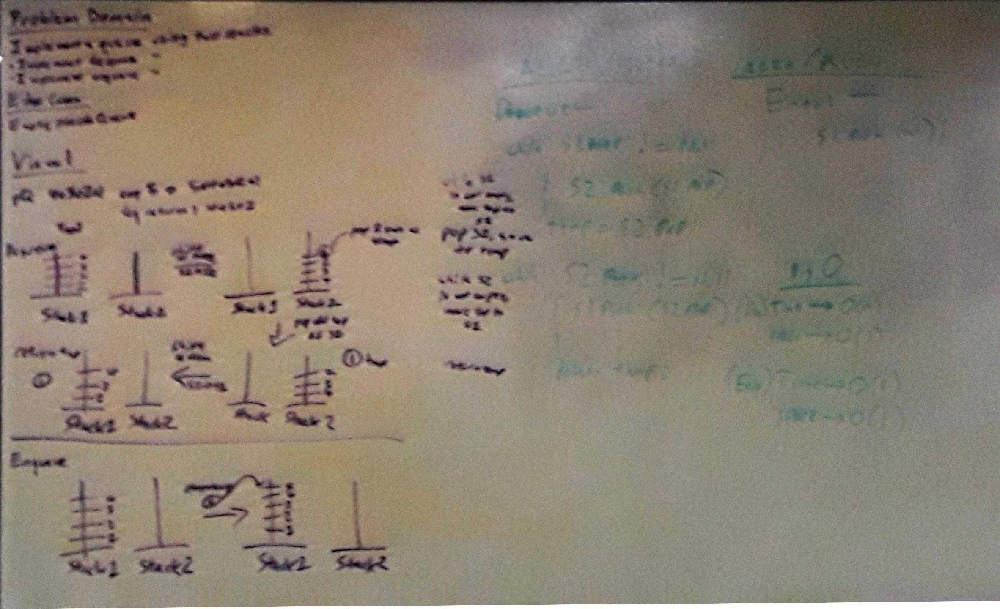
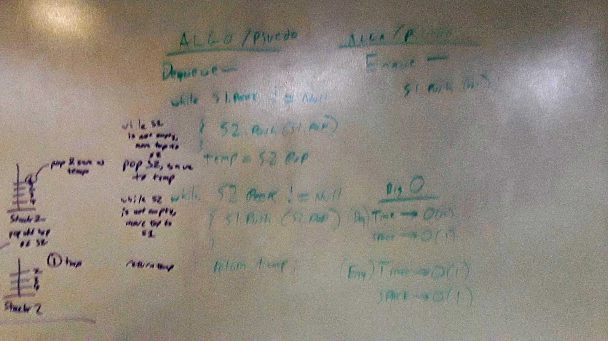

# Pseudoqueue - mimic a queue data structure with two stacks!

## Challenge
Create a brand new PseudoQueue class. Do not use an existing Queue. Instead, this PseudoQueue class will implement the standard queue interface, but will internally only utilize 2 Stack objects. Ensure that you create your class with the following methods:
- enqueue(value) which inserts value into the PseudoQueue, using a first-in, first-out approach.
- dequeue() which extracts a value from the PseudoQueue, using a first-in, first-out approach.

The Stack instances have only push, pop, and peek methods. You should use your own Stack implementation - instantiate these Stack objects in your PseudoQueue constructor.

## Approach & Efficiency

1.  This implementation hinges on the property of FILO stack that inverts the node order when each node is popped from one stack and directly pushed onto a second stack; since we can only access the top element on the first stack at any given time, the initial top element of the first stack becomes the bottom-most element on the second stack, the next top element becomes the next-bottom-most, and so on until the bottom node of the first stack, the first node added to the first stack initially, is on top of the second stack and simply can be popped off to be returned. This implementation also requires that the second stack must be empty at all times except when a dequeue action is taking place, since otherwise any nodes being added or shifted would cut in line; this means that we must return the popped node after all elements have been moved back to the first stack, and that enqueued elements must only be added to the first stack.

2.	Enqueue: Big O Time = O(1) // Big O Space = O(1); Dequeue: Big O Time = O(n) // Big O Space = O(1)
	- Enqueue: This method only requires a single push to the first stack, so inherits the O(1) time and space impact of the stack's push method.
	- Dequeue: This method requires a push for all elements on the first stack minus one twice and a single push for that last element, and requires two pops for every element on the first stack, since each element must be popped and pushed once to transfer between stacks, and the returned element still needs to be popped off the second stack in order to be returned. This results in a time impact of 2*O(n-1)+O(1)+2*O(n) => O(4n-1) < O(4n) which grows no faster than O(n). However, since we only need to create a new reference to the popped off node, the space impact is still only O(1).

## Solution

