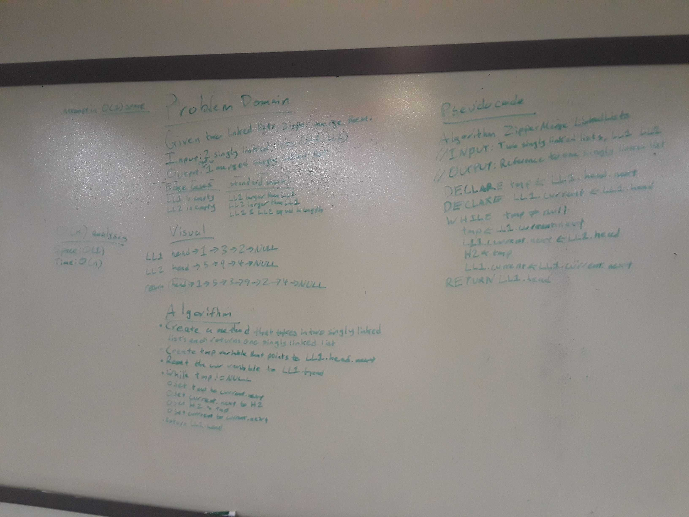

# Merge two singly linked lists

## Challenge
Write a function called mergeLists which takes two linked lists as arguments. Zip the two linked lists together into one so that the nodes alternate between the two lists and return a reference to the head of the zipped list.
Try and keep additional space down to O(1). 
You have access to the Node class and all the properties on the Linked List class as well as the methods created in previous challenges.

## Approach & Efficiency

1.  This algorithm manipulates the Current ref of the first linked list, the Head reference of the second linked list, and a temporary reference tmp in order to zipper merge the two linked lists. The manipulation runs as follows, until the temporary reference is null at the start of the loop:
	- Set the temporary reference to the current.next node of the first linked list, so that the rest of the linked list does not get lost when the current.next reference is reassigned.
	- Reassign the current.next reference to the head of the second linked list.
	- Set the head reference of the second linked list to the node the temporary reference is referencing.
	- Increment the current node by assigning current to the node referenced by current.next.
	This algorithm will result in an empty linkedListTwo and a merged linkedListOne, with the head reference of linkedListOne being directly returned.

2.	Big O Time = O(n) // Big O Space = O(1)
	- This implementation requires a traversal of both linked lists, so the time required is proportional to the longest linked list. Worst case scenario is that both lists are equal, requiring 2(n-1) node-to-node traversals - O(2n-2) == O(2n) which is proportional to O(n).
	- This implementation only requires a single temporary reference to a node to be created - this means that this implementation has a constant space impact of O(1).

## Solution

